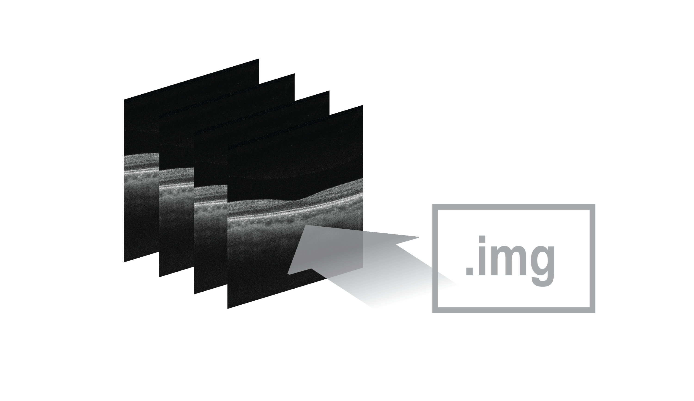

# convertPLEX
The algorithm allows the conversion of PLEX Elite 9000 exported data to image files.  Before running the algorithm, the exported data should be placed inside the current directory as follows: <br/>
1. Create and name an empty folder (e.g. ‘SamplePatient_01’).<br/>
2. Export ‘.img’ patient files as ‘IMGExportFiles’ folder, unzip and insert into the created folder (‘SamplePatient_01’).  Only one folder at a time inside the ‘IMGExportFiles’ folder can be processed at a time, and only one folder should be kept inside before running the algorithm.<br/>  
3. Export patient ‘.xml’ patient files as ‘XMLExportFiles’ folder, unzip and insert into the created folder (‘SamplePatient_01’).<br/>
4. Export all patient angiography ‘.bmp’ image sets directly into the created folder (‘SamplePatient_01’)
5. Repeat steps (1) to (5) as needed (see example below).<br/> 
6. Create and name an empty folder called 'raw' into the current directory, and insert all folders containing all files (e.g. ‘SamplePatient_01’, ‘SamplePatient_02’, etc.) into the 'raw' folder.<br/>
7. Proceed to run the command ‘call_convertPLEX’.<br/>


usage:

```matlab
call_convertPLEX()
```

Cite As

Bélanger Nzakimuena, C. (2020). Automated Analysis of Retinal and Choroidal OCT and OCTA Images in AMD (Masters thesis, Polytechnique Montréal). Retrieved from https://publications.polymtl.ca/5234/


